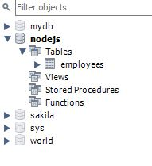

# Using-NodeJS-with-MySQL (Table of Contents)
- [Create Connection](#create-connection)
- [Create Database](#create-database)
- [Create Table](#create-table)
- [Delete](#delete)
- [Drop Table](#drop-table)
- [Insert Into](#insert-into)
- [Limit](#limit)
- [Order By](#order-by)
- [Select From](#select-from)
- [Update](#update)
- [Where](#where)

## 1. Create Connection

## 2. Create Database
 

## 3. Create Table
### Creating simple table: 
 
### Creating table with primary key: 

## 4. Delete
 

## 5. Drop Table
 

## 6. Insert Into
### Insert a record: 
 
### Insert many records: 

## 7. Limit

## 8. Order By
### Ascending order: 
 
### Descending order: 

## 9. Select From

## 10. Update
 

## 11. Where
### Basic usage of Where: 
 
### Where with Like: 

